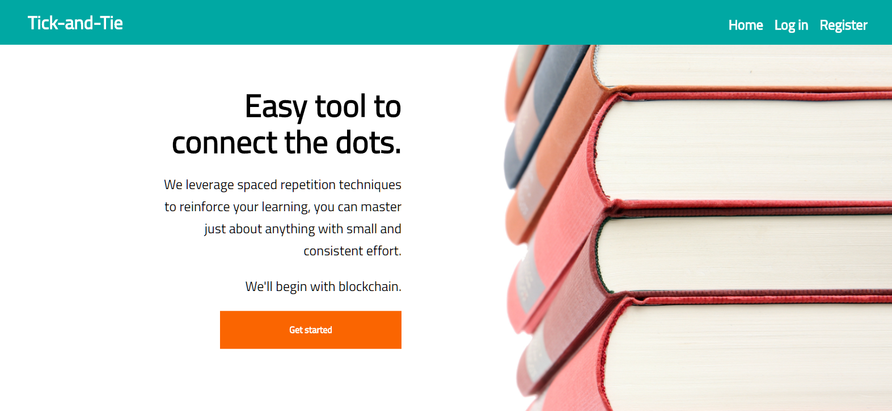
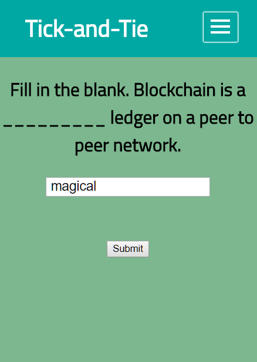
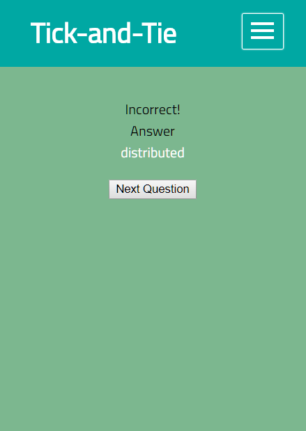

<h1 align="center">
  <br>
  Tick-and-Tie
  <br>
</h1>

<h4 align="center">A learning app to help connect the dots.</h4>
<h4 align="center">https://tnt.netlify.com/</h4>

<p align="center">
    <a href="#key-features">Key Features</a> •
    <a href="#setup">Setup</a> •
    <a href="#usage">Usage</a> •
    <a href="#screenshots">Screenshots</a> •
    <a href="#documentation">Documentation</a> •
    <a href="#history">History</a> •
    <a href="#technology-stack-credits">Technology Stack Credits</a>
</p>

---
 Tick-and-Tie (TnT) is a learning app to educate users efficiently on blockchain concepts through the use of a simplified Spaced Repetition System (SRS), executed through a linked list data structure.


---
## Key Features
+ Register a secured TnT account
+ Test user knowledge through use of flashcards
+ View flashcard
+ Answer flashcard
+ Receive feedback, whether answer is correct or incorrect
+ Access registered TnT account
---

## Setup

To clone and run this application, you'll need [Git](https://git-scm.com), [Node.js](https://nodejs.org/en/download/) (which comes with [npm](http://npmjs.com)), [MongoDB](https://www.mongodb.com/download-center#atlas) installed on your computer. 

From your command line:

```bash
# In seperate terminals, clone these repository
$ git clone https://github.com/lindafoodev/tick-and-tie-client.git
$ git clone https://github.com/lindafoodev/tick-and-tie-server.git

# In seperate terminals, go into the repositories
$ cd tick-and-tie-client
$ cd tick-and-tie-server

# Install dependencies
$ npm install

# In server repository, run mongod instance on localhost (Seperate Terminal)
$ mongod

# In both repositories, run the app
$ npm start
```
---
## Usage
After you clone this repo to your desktop, go to its root directory and run npm install to install its dependencies.

Once the dependencies are installed, run an instance of mongod. Then, you can run npm start to start the application. You will be able to access the server at localhost:8080 and the client at localhost:3000

---
## Screenshots
|  |  |  |
|:---:|:---:|:---:|
| Home Page | Card Page | Response Example |

---
## Documentation
#### Model

* `User` The User object models the users in the Users database for REST API.
  * `username` {string} Unique username provided by user on account registration
  * `password` {string} Unique password provided by user on account registration, hashed
  * `deck` [{multiple}] Consist of flashcards, cards consist of:
    * `sideA` {string} Prompt being asked of user
    * `sideB` {string} Corresponding answer to prompt being asked of user
    * `nValue` {number} value to implement spaced repetition
    * `nextCard` {number} specifies the next card for linear linked list data structure
  * `currentCard` {number} Used to track current card for user, helps with user persistence 
  * `correctCount` {number} Counts the number of instances user answered correctly
  * `incorrectCount` {number} Counts the number of instances user answered incorrectly

* `Deck` The Deck object models the cards in the Deck database for REST API.  
  * `side A` {string} Prompt being asked of user
  * `side B` {string} Corresponding answer to prompt being asked of user

#### REST API - Server

* Auth Router:
  * POST - /api/auth/login
      Creates and returns a 'local' authorization token
  * POST -/api/auth/refresh
      Creates and returns a refreshed 'jwt' authorization token

* User Router:
  * POST - /api/users
      Creates and returns a new user, including deck, through application registration
  * GET - /api/users/:id
      Retrieves the user's current card
  * GET -/api/users
      Retrieves all users in the User database, utilized for debugging purposes
  * PUT - /api/users/:id
      Updates user's account information when user answers, `currentCard`, `deck`, `correctCount`, and `incorrectCount`

* v1 Router:
  * GET - /api/v1/all
      Retrieves all cards in the Deck database, utilized for debugging purposes
  * GET - /api/v1/:id
      Retrieves card data for user's current card

#### Components - Client
  * App
  * LandingPage
  * Dashboard
  * RegistrationPage
  * LoginPage
  * DeckForm
  * Input
  * HeaderBar
  * Hamburger

---
## History
* Client| Server
* 1.0.1 | 1.0.1 - Update README
* 1.0.0 | 1.0.0 - Initial release

---
## Technology Stack Credits
This software uses code from several open source packages.

Front-end technologies
+ ES6 JavaScript
+ React/Redux
+ CSS media queries

Server technologies
+ [Express](http://expressjs.com/)
+ [bcryptjs](https://www.npmjs.com/package/bcryptjs)
+ [jsonwebtoken](https://jwt.io/)
+ [passport.js](http://www.passportjs.org/)

Data Persistence
+ [MongoDB](https://www.mongodb.com/)
+ [Mongoose](http://mongoosejs.com/)

​Hosting/SaaS
+ [Heroku](https://dashboard.heroku.com/)
+ [MLab](https://mlab.com/)

Development Environment
+ Continuous Deployment
    - [Netlify](https://netlify.com/) / [Heroku](https://dashboard.heroku.com/)
+ [Github](https://github.com/) (branching, pull requests, merging)
+ [VS Code](https://code.visualstudio.com/)
+ [Node.js](https://nodejs.org/) Libraries
    - [Nodemon](https://nodemon.io/)
    - [dotenv](https://www.npmjs.com/package/dotenv)